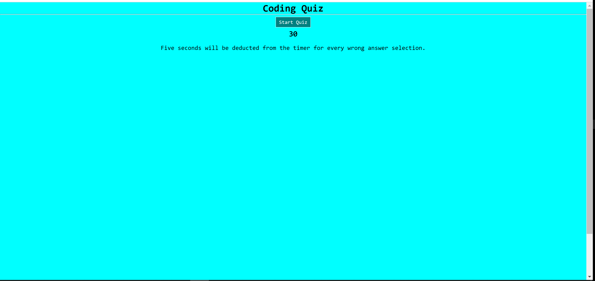
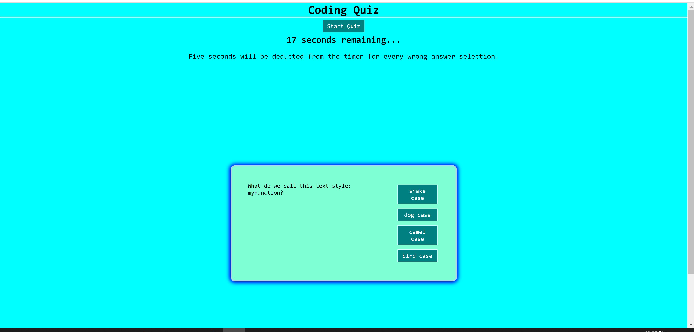
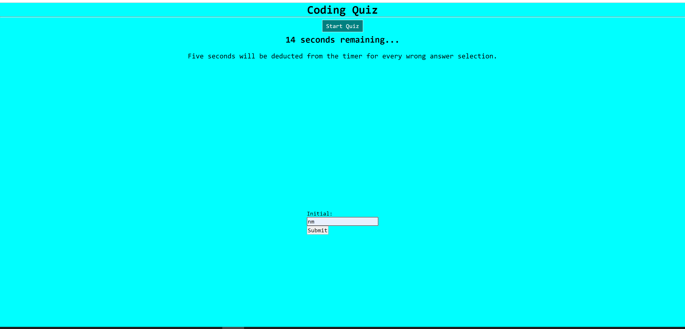

# Coding-Quiz
This is a coding quiz I made from scratch using HTML, CSS, and JavaScript.

## Introduction:

This is a coding quiz. The HTML and CSS and JavaScript were created from scratch. This project was quite challenging, but I utilized several functions and conditional logic to make it functional. 

## General Information:

In this project, I used HTML, CSS, and JavaScript to display quiz questions. Users are timed and can select answers; however, if they choose the incorrect answer, five second will be deducted from the timer. They may also enter their initials at the end of the quiz to see their initials followed by their final score.

 I used the following JavaScript tools:
1. Variables
2. Functions 
3. Arrays
4. For Loops
5. Methods
6. forEach()
7. Intervals

## Screenshots:

## Built with:

1. Visual Studio Code
2. HTML
3. CSS
4. JavaScript
5. Chrome DevTools
6. A little bit of markdown

## GitPages Link:

You can find my website here:
https://mully7773.github.io/Coding-Quiz/

## Author:

Nick Mullenmeister